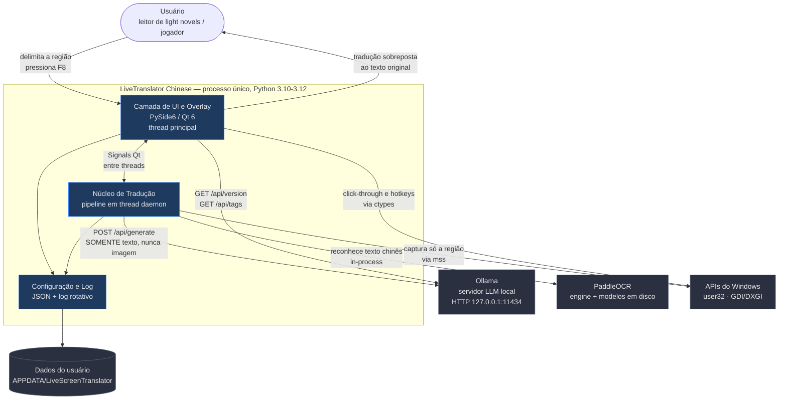
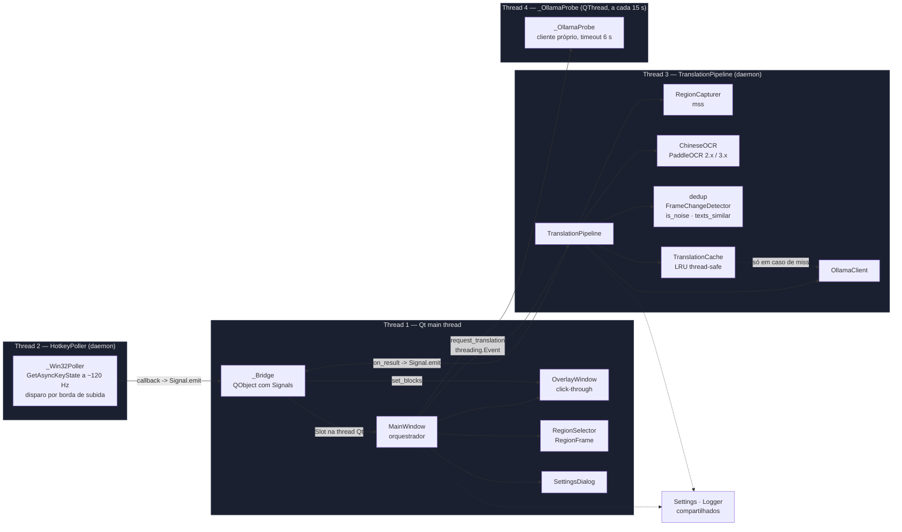
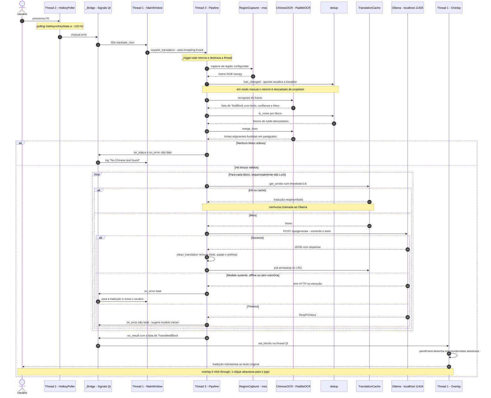

# LiveScreen Translator

Real-time **Chinese → English** screen translator for Windows 10/11.
Captures a region of your screen, runs OCR locally (PaddleOCR), translates with your **local Ollama** model and shows the result as a transparent, click-through overlay right on top of the original text. Built for games.


```
SCREEN CAPTURE → CHINESE OCR → TEXT DETECTION → LOCAL OLLAMA → ENGLISH → OVERLAY
```

**Privacy:** nothing leaves your PC. No account, no API key, no cloud. Screenshots are never sent anywhere; only the OCR text is sent to `http://localhost:11434`.

> ### Documentação de arquitetura
> Este repositório também é o objeto de um exercício de *discovery* de documentação
> (AKCIT / GenAI, Unidade III): a descrição do sistema em linguagem natural, os diagramas
> Mermaid (containers, componentes/threads e sequência) e o registro do que a GenAI acertou
> e do que precisou ser corrigido estão logo abaixo, em
> **[Documentação de Arquitetura — Discovery](#documentação-de-arquitetura--discovery)**.

---

# Documentação de Arquitetura — Discovery

> **Atividade da Unidade III (AKCIT / GenAI): *diagrams as code*.**
> Sistema escolhido: este próprio repositório — um tradutor de tela que eu uso para ler *light novels* e novels de jogos em chinês que não têm tradução oficial.
> Os diagramas abaixo foram gerados com GenAI e depois confrontados com o código-fonte. A [seção 5](#5-decisões-e-ajustes-sobre-o-que-a-genai-gerou) registra exatamente o que o modelo acertou, o que estava errado e por quê.

---

## 1. Descrição do sistema em linguagem natural

### 1.1 Escopo

Aplicativo desktop para Windows 10/11 que traduz texto chinês exibido na tela, sobrepondo a tradução em inglês sobre o texto original, sem modificar o programa de origem.

O fluxo de uso é: o usuário delimita **uma vez** a região da tela onde o texto aparece (a caixa de diálogo de um jogo, o painel de texto de um leitor de novels) e, a cada tela nova, pressiona uma tecla para receber a tradução sobreposta. O texto reconhecido é traduzido por um LLM que roda na própria máquina.

**No escopo:**

- Captura de uma região retangular arbitrária da tela.
- OCR de chinês simplificado (`ch`) e tradicional (`chinese_cht`).
- Tradução chinês → inglês por LLM local via Ollama.
- Overlay transparente, sempre no topo e *click-through* (cliques atravessam para o jogo).
- Hotkeys globais que funcionam enquanto o jogo está em foco.
- Persistência de preferências e log local rotativo.

**Fora do escopo — decisões explícitas, não lacunas:**

- Tradução de áudio, voz ou vídeo.
- Outros pares de idioma além de chinês → inglês.
- Qualquer serviço em nuvem, conta de usuário ou chave de API.
- Leitura ou escrita na memória do processo de origem. O app lê **apenas pixels da tela**; nunca faz *hooking* nem injeção em outro processo.
- OCR de imagens em arquivo (só tela ao vivo).
- Tradução automática contínua. Existe código para isso, mas está desativado por decisão de produto — ver lacuna **L02**.

### 1.2 Nível da visão

| Visão | Nível C4 | Por que esse nível |
|---|---|---|
| Containers ([seção 2](#2-diagrama-estrutural--visão-de-containers-c4-nível-2)) | Nível 2 | O sistema é **um único processo**, então o nível 2 é quase degenerado. O valor dele aqui é delimitar a fronteira: deixar explícito que Ollama e PaddleOCR são dependências **externas** ao app, não partes dele. |
| Componentes e threads ([seção 3](#3-diagrama-estrutural--componentes-e-threads-c4-nível-3-parcial)) | Nível 3 (parcial) | É onde a arquitetura real vive. O sistema é organizado por **thread**, não por camada — um diagrama de componentes que ignore as fronteiras de thread descreve um sistema que não é este. |
| Jornada crítica ([seção 4](#4-diagrama-comportamental--sequência-da-jornada-crítica)) | Comportamental | Diagrama de sequência do caminho que o usuário exercita a cada tela: pressionar `F8` e receber a tradução. |

### 1.3 Limites e responsabilidades

| Componente | É responsável por | **Não** é responsável por |
|---|---|---|
| `main.py` / `run.py` | Bootstrap do Qt, carregar `Settings`, configurar logging. | Qualquer regra de tradução. |
| `ui/main_window.py` | Orquestrar tudo: ciclo de vida do pipeline, estado dos botões, log visível, registro das hotkeys. | Capturar, reconhecer ou traduzir. |
| `ui/main_window.py::_Bridge` | Transportar callbacks da thread do pipeline para a thread Qt via `Signal`. | Lógica de negócio. É só uma ponte. |
| `pipeline.py` | Orquestrar captura → OCR → filtro → cache/Ollama → callbacks. Classificar erro como fatal ou não. | Desenhar na tela; conhecer Qt. |
| `capture.py` | Capturar **somente** a região configurada via `mss`. | Decidir quando capturar. |
| `ocr.py` | Executar PaddleOCR, normalizar o resultado das APIs 2.x e 3.x, fundir linhas adjacentes em parágrafos. | Filtrar ruído (isso é de `dedup.py`). |
| `dedup.py` | Detectar mudança de frame, normalizar texto, medir similaridade, heurísticas de ruído de OCR. | Guardar traduções. |
| `cache.py` | Cache LRU thread-safe, com busca por similaridade. | Persistir entre sessões — ver **L04**. |
| `ollama_client.py` | Falar HTTP com o Ollama, traduzir erro HTTP em exceção tipada, limpar a resposta do modelo. | Decidir se o erro para o pipeline. |
| `overlay.py` | Desenhar as traduções em coordenadas absolutas de tela; ser click-through. | Saber de onde vem o texto. |
| `region_selector.py` | Seleção e ajuste visual da região. | Persistir a região. |
| `hotkey.py` | Detectar combinações de tecla globalmente, fora do loop de eventos do Qt. | Saber o que a tecla faz. |
| `config.py` | Dataclass de configuração, *clamp* de valores, persistência em JSON. | Validar semanticamente (ex.: se o modelo existe). |
| `logger.py` | Log rotativo local e filtro de privacidade do texto. | — |

### 1.4 Integrações

| Integração | Protocolo / mecanismo | Direção | Observações |
|---|---|---|---|
| **Ollama** | HTTP REST em `127.0.0.1:11434` — `GET /api/version`, `GET /api/tags`, `POST /api/generate` | Saída | Única integração de rede. `stream: false`, `temperature: 0.0`, `num_predict: 512`, `keep_alive: 10m`. Envia **apenas o texto reconhecido**, nunca a imagem. |
| **PaddleOCR** | Biblioteca Python in-process | Interna | Baixa ~20 MB de modelos para `%USERPROFILE%\.paddleocr` no primeiro uso. Suporta CPU e GPU. |
| **Captura de tela** | `mss` (GDI/DXGI no Windows) | Entrada | Captura apenas o retângulo configurado, não a tela inteira. |
| **API do Windows** | `ctypes` → `user32`: `GetAsyncKeyState`, `GetWindowLongW`/`SetWindowLongW` | Bidirecional | Hotkeys por *polling* e estilos estendidos de janela para click-through. |
| **Sistema de arquivos** | `%APPDATA%\LiveScreenTranslator\` | Bidirecional | `settings.json` e `livescreen.log` (rotativo, 2 MB × 4). |

### 1.5 Restrições

- **Plataforma:** Windows 10/11. O click-through (`WS_EX_TRANSPARENT`) e as hotkeys (`GetAsyncKeyState`) são específicos de Win32. Há *fallback* para o pacote `keyboard` fora do Windows, mas o overlay não é funcionalmente equivalente.
- **Python 3.10–3.12**, imposto pelo PaddleOCR.
- **100% local, por requisito de produto.** Nenhum dado sai da máquina. Isso elimina qualquer API de tradução em nuvem do espaço de solução.
- **O jogo precisa rodar em modo janela ou *borderless*.** Tela cheia exclusiva esconde qualquer overlay — limitação do Windows, não do app.
- **Uma requisição ao Ollama por vez** (`threading.Lock`), para não saturar a GPU.
- **Elevação:** se o jogo roda como administrador, o app também precisa (`scripts\run_admin.bat`), senão o Windows bloqueia a leitura do teclado.
- **Empacotamento:** PyInstaller *one-folder*. `--onefile` é inviável com as DLLs nativas do Paddle e do Qt.
- **O `.exe` precisa ser construído no Windows** — PyInstaller não faz *cross-compile*.

### 1.6 Lacunas conhecidas

Lacuna aqui significa: **ponto em que o código tomou uma decisão que a documentação não justifica**, ou em que não existe decisão registrada. São exatamente os pontos onde um agente de desenvolvimento inventaria comportamento.

| ID | Lacuna | Impacto |
|---|---|---|
| **L01** | Nenhum dos números mágicos de heurística tem justificativa registrada nem vetor de teste: `change_threshold = 4.0`, `text_similarity = 0.8`, `stable_frames = 2`, e em `is_noise()` os limites `0.35` de proporção CJK, `6` caracteres latinos e `0.6` de repetição de glifo. | Um agente reescreveria com outros valores, igualmente defensáveis, e mudaria o comportamento observável. |
| **L02** | O modo automático existe, está testado, e é **inalcançável em produção**: `translate_mode` é forçado para `"manual"` em três pontos distintos. Não há registro de se isso é temporário ou definitivo. | O agente não sabe se deve manter, remover ou reativar o caminho. |
| **L03** | O contrato com a saída do LLM é implícito. `clean_translation()` remove blocos `<think>`, sufixo `/no_think`, aspas envolventes e prefixos como `"Translation:"` — ou seja, assume comportamentos específicos de certos modelos, sem documentar quais nem por quê. | Trocar o modelo pode quebrar a limpeza silenciosamente. |
| **L04** | O cache de traduções é recriado a cada `start_translation()` e **não** sobrevive a um stop/start nem a salvar as configurações. Não há decisão registrada sobre persistir ou não entre sessões. | Comportamento surpreendente; um agente escolheria arbitrariamente. |
| **L05** | Não há política definida para o caso de o `xclip`/backend de hotkey não estar disponível, nem para o *fallback* não-Windows. O código degrada silenciosamente com `log.warning`. | Falha silenciosa em plataforma não suportada. |
| **L06** | O sistema de coordenadas não está especificado em nenhum lugar. `TextBlock` usa coordenadas **relativas à região**; o overlay converte para **absolutas de tela** em `block_screen_rect()` somando `region.x/y`, o *offset* do usuário e subtraindo a origem da própria janela. | É o ponto mais fácil de um agente errar e o erro é visual e sutil (tradução desalinhada). |
| **L07** | Multi-monitor e DPI: o overlay une a geometria de todas as telas e a política de arredondamento é `PassThrough`, mas não há especificação de comportamento esperado com monitores de DPI diferentes. | Não testável sem hardware específico; comportamento indefinido. |
| **L08** | A taxonomia fatal/não-fatal de erros está codificada em chamadas espalhadas de `_error(msg, fatal=...)`, sem tabela de referência. O limite de `10` erros consecutivos também não é justificado. | Um agente recriaria a classificação de forma diferente. |

---

## 2. Diagrama estrutural — visão de containers (C4 nível 2)



**Como ler:** a fronteira `app` é um processo único do sistema operacional. Tudo fora dela é dependência externa que precisa existir na máquina do usuário. A seta mais importante é `core -> ollama`: é a **única** comunicação de rede do sistema, ela vai para `localhost`, e transporta apenas texto.

---

## 3. Diagrama estrutural — componentes e threads (C4 nível 3 parcial)

Esta é a visão que descreve o sistema de verdade. As quatro raias são **threads reais**, e cada travessia de raia é um ponto de sincronização explícito no código.



**As três travessias de thread que importam:**

1. `HotkeyPoller → _Bridge → MainWindow` — a tecla é detectada **fora** do loop de eventos do Qt, por *polling* com `ctypes`. É por isso que ela funciona com o jogo em foco. O resultado entra no Qt por `Signal`, que é o mecanismo thread-safe do Qt.
2. `MainWindow → TranslationPipeline` — não é chamada de método: `request_translation()` apenas seta um `threading.Event`, que a thread do pipeline está aguardando com `_trigger.wait(0.25)`. Desacoplamento total.
3. `TranslationPipeline → _Bridge → OverlayWindow` — o pipeline **nunca** toca em widget Qt. Ele chama callbacks que são `Signal.emit`, e o Qt entrega na thread principal.

---

## 4. Diagrama comportamental — sequência da jornada crítica

Jornada: **o usuário está lendo uma novel, aparece uma tela nova de texto chinês, ele pressiona `F8` e lê a tradução sobreposta.** É o caminho exercitado dezenas de vezes por sessão.



**Pontos não óbvios que o diagrama torna explícitos:**

- A tecla **não** passa pelo loop de eventos do Qt — por isso funciona com o jogo em foco.
- `has_changed()` é chamado no modo manual **e o retorno é jogado fora**. Não é bug: serve para atualizar a linha de base do detector, de modo que o modo automático (se reativado) não considere essa mesma tela como "nova".
- O cache é consultado **por bloco**, com busca por similaridade (`0.8`), não por igualdade exata. Duas leituras de OCR ligeiramente diferentes da mesma linha reaproveitam a tradução.
- As traduções são **sequenciais** sob um `Lock`, deliberadamente. Nunca há duas requisições em voo.
- O resultado fica fixo na tela até o próximo `F8` ou até `F9` limpar.

---

## 5. Decisões e ajustes sobre o que a GenAI gerou

Esta seção é o cerne da atividade. A GenAI gerou os diagramas em dois passes: o primeiro a partir do **README e dos nomes dos módulos**, o segundo depois de **ler o código-fonte inteiro**. A diferença entre os dois é o achado mais útil do exercício.

### 5.1 O que o modelo inferiu corretamente

- **A separação de responsabilidades por módulo**, direto dos nomes e das docstrings: captura, OCR, dedup, cache, cliente HTTP, overlay, hotkey. O mapa de responsabilidades da seção 1.3 saiu quase pronto e resistiu à conferência com o código.
- **Que Ollama e PaddleOCR são dependências externas**, não partes do app — fronteira correta no diagrama de containers.
- **Que o sistema é um processo único** e não inventou microsserviços, que é o erro clássico relatado por colegas nesta atividade.
- **A natureza da integração com o Ollama:** identificou os três endpoints e, corretamente, que só texto é enviado — nunca imagem. Isso estava afirmado no README e é verdade no código (`build_payload` monta apenas `prompt` e `system`).
- **O modelo de concorrência em alto nível:** UI não bloqueia, pipeline em thread separada, comunicação por `Signal`.
- **A taxonomia de erros do Ollama** como parte relevante da arquitetura, e não como detalhe de implementação — `OllamaOffline`, `OllamaModelNotFound`, `OllamaTimeout`, `OllamaOutOfMemory` mapeiam para decisões distintas de parar ou continuar.

### 5.2 O que eu precisei ajustar

Seis correções. As quatro primeiras foram encontradas confrontando o diagrama com o código; são divergências **verificáveis**, não questões de gosto.

**A1 — O componente de deduplicação por hash não está ligado no pipeline.**
O primeiro diagrama mostrava um estágio "dedup por hash de texto" no fluxo, porque o README afirma *"text-hash dedup so identical OCR output is never re-translated"* e a classe `TextDeduplicator` existe, com testes próprios. Mas no `pipeline.py`, `text_dedup.is_new()` **nunca é chamado** — só `reset()`. A deduplicação real acontece por outro caminho: comparação de similaridade contra `_last_texts` via `texts_similar()`. Removi o estágio do diagrama e registrei a divergência. **O README do projeto está descrevendo um componente que não participa do fluxo.**

**A2 — O modo automático é inalcançável em produção.**
O diagrama de sequência inicial mostrava um laço de *polling* (`process_once()`) como jornada principal, que é o que a leitura do código sugere. Mas `translate_mode` é forçado para `"manual"` em três pontos: `config.py:99` (no carregamento das configurações salvas), `main_window.py:246` (ao iniciar) e `settings_dialog.py:134`. Ou seja, o laço automático só é alcançado pelos testes. Refiz o diagrama comportamental para a jornada manual do `F8`, que é a única real, e registrei o modo automático como lacuna **L02**.

**A3 — `has_changed()` no modo manual tem o retorno descartado.**
A inferência inicial ligava o detector de mudança de frame como um portão condicional em todos os fluxos. No caminho manual (`pipeline.py:213`) ele é chamado sem que o retorno seja usado. Não é código morto — atualiza a linha de base do detector — mas é um efeito colateral que nenhum diagrama inferido acertaria. Está explícito como `Note` no diagrama.

**A4 — O cache não sobrevive a um stop/start.**
O diagrama tratava `TranslationCache` como estado de longa duração do app. Na prática, `main_window.py:251` instancia um `TranslationPipeline` novo a cada início sem passar `cache=`, e o construtor cria um LRU vazio. Como salvar configurações também reinicia o pipeline, o cache é perdido nessa operação. O motor de OCR, em contraste, **é** reaproveitado (`self.ocr_engine`), justamente para evitar os 5–20 s de recarga. Essa assimetria não está documentada em lugar nenhum: virou a lacuna **L04**.

**A5 — O overlay não é um container separado.**
O primeiro passe desenhou o overlay como um processo/container próprio, o que é a arquitetura "natural" para esse tipo de ferramenta. É um `QWidget` no mesmo processo, cobrindo a união geométrica de todas as telas, com click-through obtido por estilos estendidos do Win32. Corrigido para ficar dentro da fronteira do processo.

**A6 — Restrições de sintaxe do Mermaid.**
Parte do que o modelo gerou era visualmente correto e tecnicamente inválido. Removi: `<br>` dentro de `Note over` (o parser não aceita nessa posição); setas e símbolos matemáticos Unicode (`→`, `≤`, `≠`) em mensagens de sequência e rótulos de nó, trocados por `->` e `<=`; emojis no corpo dos diagramas; e parênteses não escapados em nomes de `participant`. Mantive acentuação portuguesa e travessões dentro de rótulos entre aspas, que o parser aceita sem problema. As setas Unicode ficaram só na prosa em Markdown, onde não passam por parser. Cada bloco foi validado com o parser oficial do Mermaid antes do commit — não só inspecionado visualmente.

### 5.3 O que decidi deliberadamente **não** mudar

- **Não elevei o nível de abstração.** Um diagrama de containers bonito e genérico ("Frontend / Backend / Banco") seria inútil aqui: o sistema é um processo único e o que importa são as fronteiras de *thread*. Por isso a visão de nível 3 é a principal, não a de nível 2.
- **Não inventei componentes ausentes.** Não há banco de dados, fila, autenticação nem camada de API, e resisti à tentação de desenhar caixas para "completar" a arquitetura.
- **Não documentei o modo automático como se funcionasse.** Ele está no código e testado, mas inalcançável. Registrei como lacuna em vez de descrever como recurso.

---

## 6. O que a documentação precisaria ter a mais para um agente construir o sistema sem inventar decisões

Esta é a pergunta central da atividade. Os diagramas acima respondem *o que existe* e *como as peças conversam*, mas um agente ainda inventaria decisões nos pontos abaixo.

### 6.1 ADRs — as decisões que estão no código, mas não estão registradas como decisões

Todas estas escolhas são visíveis no código e nenhuma tem justificativa documentada. Um agente recriaria cada uma com alternativas igualmente defensáveis, produzindo um sistema diferente:

| Decisão tomada | Alternativa óbvia que um agente escolheria | Por que a escolha atual não é arbitrária |
|---|---|---|
| `mss` para captura | `PIL.ImageGrab`, `pyautogui` | `mss` captura **só o retângulo**, sem custo de tela cheia. |
| PaddleOCR | Tesseract, EasyOCR | Acurácia em chinês simplificado **e** tradicional. |
| `GetAsyncKeyState` por *polling* | `RegisterHotKey` ou hook do pacote `keyboard` | Jogos com DirectInput/raw-input bloqueiam hooks; *polling* não é bloqueável. |
| `POST /api/generate` | `POST /api/chat` | `generate` é *stateless*; não há histórico a manter. |
| `temperature: 0.0`, `num_predict: 512` | Defaults do modelo | Tradução precisa ser determinística e curta. |
| `keep_alive: 10m` | Default de 5 min | Evita recarregar o modelo entre telas. |
| PyInstaller *one-folder* | `--onefile` | DLLs nativas de Paddle e Qt quebram no *onefile*. |
| `stream: false` | Streaming | A tradução só é útil completa, para medir o layout do overlay. |

**Sem esses ADRs, um agente trocaria `mss` por `ImageGrab` e reintroduziria a captura de tela inteira, ou trocaria o polling por hook e quebraria a funcionalidade central com o jogo em foco.**

### 6.2 Contrato do sistema de coordenadas (a lacuna mais perigosa)

Precisa estar especificado formalmente: `TextBlock.x/y` é **relativo à região capturada**; `OverlayWindow.block_screen_rect()` converte para absoluto somando `region.x/y` e o *offset* do usuário e subtraindo a origem da janela do overlay, que por sua vez é a união geométrica de todos os monitores. São três sistemas de coordenadas em uma conta de uma linha. Um agente erraria aqui com altíssima probabilidade, e o erro é visual e sutil — a tradução aparece deslocada, não quebra.

Faltam: definição dos três referenciais, a fórmula de conversão, e casos de teste com monitores em posições negativas (monitor à esquerda do primário gera `x` negativo).

### 6.3 Contrato da saída do LLM e do pós-processamento

`clean_translation()` remove blocos `<think>`, sufixo `/no_think`, aspas envolventes e prefixos como `"Translation:"`, `"English:"`, `"Translated text:"`. Isso é um contrato implícito com o comportamento de modelos específicos (qwen3, deepseek-r1). Precisa documentar: para quais modelos cada regra existe, o que acontece com um modelo que não está na lista, e se a lista de prefixos é exaustiva ou heurística.

### 6.4 Critérios de aceite testáveis para as heurísticas

Os números da lacuna **L01** precisam de vetores de entrada/saída concretos, não de prosa. Por exemplo, para `is_noise()`: dado `"图图图图"`, esperar `True` (glifo repetido acima de 0.6); dado `"你好"` com `min_chinese=2`, esperar `False`; dado `"Loading assets... 你好"`, esperar `True` (mais de 6 latinos). Hoje os testes cobrem o comportamento, mas a **especificação** de por que esses limites, e o que deve acontecer nas bordas, não existe.

### 6.5 Tabela de classificação de erros

A distinção fatal / não-fatal está espalhada em chamadas de `_error(msg, fatal=...)`. Precisa de uma tabela: condição → fatal? → mensagem ao usuário → ação de recuperação. Incluindo a justificativa do limite de 10 erros consecutivos.

### 6.6 Decisões de produto ainda abertas

Um agente não pode decidir estas sozinho, e a documentação precisa dizer explicitamente que são **decisões pendentes, não liberdade de implementação**:

- O modo automático deve ser removido, mantido morto, ou reativado? (**L02**)
- O cache deve persistir entre sessões? (**L04**)
- Qual o comportamento esperado fora do Windows: recusar a execução com mensagem clara, ou degradar silenciosamente como hoje? (**L05**)
- Suporte a outros pares de idioma é escopo futuro ou exclusão permanente?

### 6.7 Conclusão do exercício

A lição prática foi que **Mermaid + Markdown + Git tornam a arquitetura versionável, mas não a tornam verdadeira.** Os dois passes da GenAI produziram diagramas igualmente plausíveis e visualmente convincentes; só o confronto com o código separou o que o sistema é do que ele parece ser. Três dos seis ajustes (A1, A2, A4) são casos em que a **documentação existente do próprio projeto estava errada** — o README afirmava um mecanismo de dedup que não está ligado, e descrevia um modo de operação inalcançável.

Para servir de contexto a um agente, a documentação precisa marcar explicitamente três categorias, e não só descrever a solução: **o que já foi decidido e por quê** (ADRs), **o que ainda está aberto** (lacunas), e **o que o agente não tem autoridade para decidir sozinho** (decisões de produto).

---

# Manual de uso e instalação

## 1. Architecture (and why)

| Layer | Choice | Reason |
|---|---|---|
| Language | Python 3.10–3.12 | PaddleOCR is Python-only; fastest path to a working, maintainable app. |
| GUI / overlay | **PySide6 (Qt 6)** | Native Windows look, real per-pixel transparent windows, `WindowTransparentForInput` + Win32 `WS_EX_TRANSPARENT` for true click-through over games, high-DPI aware. |
| Capture | **mss** | Very fast region-only grabs (no full-screen capture), zero heavy deps. |
| OCR | **PaddleOCR** (`ch` / `chinese_cht`) | Best open-source accuracy for Simplified + Traditional Chinese; runs on CPU or GPU. |
| Translation | **Ollama REST API** (`/api/generate`) | Fully local; user picks any installed model (e.g. `qwen3:8b`). |
| Concurrency | One background daemon thread (`pipeline.py`) + Qt signals | UI thread never blocks; exactly one Ollama request in flight; simple to reason about. |
| Packaging | PyInstaller one-folder `.exe` | Reliable with Paddle's native DLLs. |

Pipeline optimizations: configurable OCR interval (throttle), downscaled frame-diff so unchanged frames skip OCR entirely, text-hash dedup so identical OCR output is never re-translated, LRU translation cache, sequential Ollama requests (no request storms).

```
livescreen_translator/
  config.py          settings dataclass + JSON persistence (%APPDATA%\LiveScreenTranslator)
  capture.py         region capture (mss)
  ocr.py             PaddleOCR wrapper, result parsing (v2/v3), line merging
  dedup.py           frame change detector, text normalization/hash
  cache.py           thread-safe LRU cache
  ollama_client.py   Ollama client, error types, response parsing (strips <think>)
  pipeline.py        capture→diff→OCR→dedup→cache/Ollama loop (background thread)
  overlay.py         click-through overlay window
  region_selector.py drag-to-select + movable/resizable region frame
  hotkey.py          global hotkey (keyboard package)
  logger.py          rotating local log (text logging can be disabled)
  ui/main_window.py  main window; ui/settings_dialog.py  settings
tests/               pytest suite (58 tests)
scripts/             install.bat, run.bat, dev.bat, test.bat, build_exe.bat
LiveScreenTranslator.spec  PyInstaller spec
run.py               launcher
```

---

## 2. Install & start Ollama

1. Download and install Ollama for Windows: <https://ollama.com/download/windows>
2. Ollama starts automatically (tray icon) and listens on `http://localhost:11434`.
   To start it manually: open a terminal and run `ollama serve`.
3. Verify: open <http://localhost:11434> in a browser → you should see `Ollama is running`.

### Install a model

```bat
ollama pull qwen3:8b
```

Recommended models by hardware:

| Model | VRAM/RAM | Notes |
|---|---|---|
| `qwen3:8b` | ~6 GB | Default. Excellent Chinese→English. |
| `qwen3:4b` | ~3 GB | Faster, good for weaker GPUs / CPU-only. |
| `qwen2.5:7b` | ~5 GB | Very good, no "thinking" overhead. |
| `gemma3:4b` | ~3.5 GB | Fast alternative. |

List installed models: `ollama list`.

---

## 3. Install the app (from source)

Requirements: Windows 10/11, **Python 3.10, 3.11 or 3.12** (from python.org, tick *Add Python to PATH*).

```bat
git clone <this repo>  (or unzip the folder)
cd LiveScreenTranslator
scripts\install.bat
```

`install.bat` creates a `.venv`, installs PySide6, mss, PaddleOCR/PaddlePaddle (CPU) and the other dependencies.
This downloads several hundred MB. On first OCR run PaddleOCR downloads its models (~20 MB) into `%USERPROFILE%\.paddleocr`.

Run the app:

```bat
scripts\run.bat
```

Developer loop (installs dev deps, runs tests, launches with console):

```bat
scripts\dev.bat
```

### GPU acceleration for OCR (optional)

CPU OCR is fine for a dialog-box sized region. For large regions on an NVIDIA GPU:

```bat
.venv\Scripts\activate
pip uninstall paddlepaddle
pip install paddlepaddle-gpu
```

then tick **Use GPU for OCR** in Settings.

---

## 4. Build the .exe

```bat
scripts\build_exe.bat
```

Output: **`dist\LiveScreenTranslator\LiveScreenTranslator.exe`**
Distribute the entire `dist\LiveScreenTranslator` folder (it contains Qt and Paddle DLLs). The `.exe` needs no Python installed, but the target PC still needs **Ollama** installed and running.

> The `.exe` must be built **on Windows** (PyInstaller does not cross-compile). This project was developed and tested on Linux CI, so the binary is not included in the zip — run `build_exe.bat` once on your PC.

Troubleshooting builds: set `console=True` in `LiveScreenTranslator.spec` to see errors; if PaddleOCR complains about missing files, the spec already uses `collect_all` for `paddleocr`/`paddle` — make sure you build from inside the `.venv`.

---

## 5. First use

1. Start Ollama and make sure a model is pulled (`ollama pull qwen3:8b`).
2. Launch **LiveScreen Translator**. The status line should read **Ollama: Connected**.
   If it says **Offline**, click **Test Connection** after starting Ollama.
3. Pick the model from the **Model** dropdown (click **Refresh models** to list installed ones).
4. Click **Select Region** and drag a rectangle over the area where Chinese text appears (e.g. a dialog box).
   Use **Show/adjust frame** to move/resize the region later.
5. Click **Start Translation** (or press the global hotkey, default **Ctrl+Shift+T**).
6. The first start loads PaddleOCR (5–20 s). After that, whenever the text in the region changes, the English translation appears over it. Unchanged text is never re-translated.
7. Press the hotkey or **Stop Translation** to stop. **Clear overlay** hides current boxes.

### Translating (manual, on key press)

The app translates **only when you ask**: with translation started, press the translate hotkey (default **F8**, configurable — e.g. `t`, `ctrl+t`) to capture the region, translate it and pin the result on screen until the next press. Nothing is translated automatically. The **Translate now** button does the same. Press the clear hotkey (default **F9**) to remove the current translation from the screen (works in both modes; leave the field empty in Settings to disable).

### Settings

| Setting | Description |
|---|---|
| OCR language | `ch` (Simplified; also reads most Traditional) or `chinese_cht` (Traditional). |
| OCR interval | How often the region is checked (ms). Higher = less CPU. |
| Min. confidence | Drop OCR lines below this confidence. |
| Frame change threshold | Sensitivity of the frame-diff skip (raise if video backgrounds trigger OCR constantly). |
| Ollama URL / model / timeout | Local server settings. |
| Font size, opacity, show original, offset | Overlay appearance and position. |
| Hotkeys | Start/stop, translate (F8) and clear (F9). Any `f1..f24`, letters, digits, with `ctrl`/`shift`/`alt`. Hotkeys are read via Win32 `GetAsyncKeyState`, so they work while games have focus. |
| Region | Manual x, y, w, h. |
| Logs | Enable log file; disable **text logging** for extra privacy (screenshots are never logged). |

Settings file: `%APPDATA%\LiveScreenTranslator\settings.json`
Log file: `%APPDATA%\LiveScreenTranslator\livescreen.log`

---

## 6. Error handling

| Situation | Behaviour |
|---|---|
| Ollama not running | Status shows *Offline*; start is blocked at first request with a clear message. Auto-rechecks every 15 s. |
| Model not installed | Log shows `ollama pull <model>`; translation stops (fatal). |
| Timeout / slow model | Non-fatal warning with suggestion to use a smaller model; status shows per-block latency. |
| Ollama out of memory | Fatal with suggestion (`qwen3:4b`). |
| OCR failure / OOM | Non-fatal; pipeline stops after 10 consecutive errors. |
| Invalid region | Start refused; select a region. |
| Hotkey cannot be registered | UI still works with the button. |
| Hotkeys ignored while the game has focus | The game runs as administrator: start the app with `scripts\run_admin.bat`. |

---

## 7. Tests

```bat
scripts\test.bat          (or: python -m pytest -q)
```

Covers: Ollama communication (mocked HTTP), response parsing (incl. `<think>` stripping), model listing, cache/LRU, frame & text deduplication, PaddleOCR result parsing (v2 and v3 formats), full OCR→translation pipeline with fakes, overlay geometry/flags, settings persistence.

---

## 8. Games: tips

- Run the game in **Borderless / Windowed** mode. Exclusive full-screen hides all overlays (any tool).
- Keep the region tight around the text box — faster OCR, fewer false positives.
- If the overlay covers the original text, use **Show original** or an **offset** (e.g. Y = +40) in Settings.
- Use a smaller model if translations lag behind the dialog.


